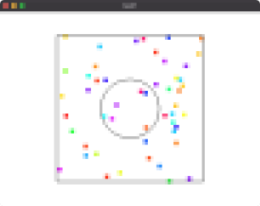
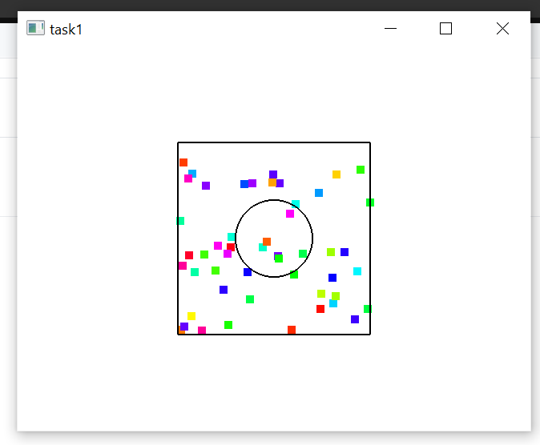
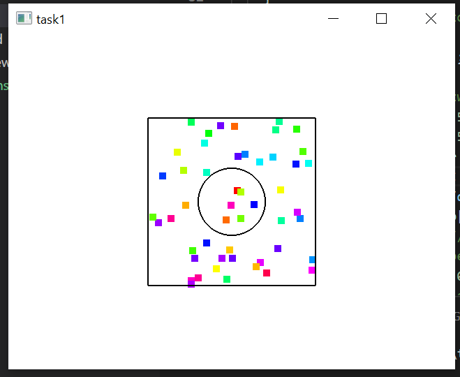

# Task1: Particle System

**deadline: April 29th (Thu) at 15:00pm**




## Setting Up

Pleae look at the following document for environment setup, creating branch, and making pull request.

[How to Submit the Assignment](../doc/submit.md)

- make sure you synchronized the `main ` branch of your local repository  to that of remote repository.
- make sure you created branc h `task1` from `main` branch. 
- make sure you are currently in the `taask1` branch (use `git branch -a` command).
  

Additionally, you need the library [DelFEM2](https://github.com/nobuyuki83/delfem2) in `pba-<username>/3rd_party` 

```bash
$ cd pba-<username> # go to the top of local repository
$ git submodule update --init 3rd_party/delfem2
```

(DelFEM2 is a collection of useful C++ codes written by the instructer).


## Problem1

1. Build the code using cmake 
2. Run the code
3. Take a screenshot image (looks like image at the top)
4. Paste the screenshot image below

   

=== Paste the screen shot here ===



## Problem 2

Modify `main.cpp` to collide points with the circular obstacle in the middle (see around 92th line of the code). Just 4 or 5 lines of codes need to be modifiled. We assume that the **coefficient of restitution** is one.


=== Paste the screen shot here  ===


modified code:

''' C++
if( dist_from_center < 0.2 &&  dist_from_center > 0.19){ // collision with obstacle (inside and outside)
        float norm[2] = {dx/dist_from_center, dy/dist_from_center }; // unit normal vector of the circle
        float vnorm = p.velo[0]*norm[0] + p.velo[1]*norm[1]; // normal component of the velocity
        ////////////////////////////
        // write something below !
        float vtan = p.velo[0]*norm[1] - p.velo[1]*norm[0]; // tangential component of the velocity
        //rotated the vnorm and vtan around the z axis ccw R = [[normY normX],[-normX normY]]
        // [vX_f,vY_f] = R*[vtan,-vnorm] 
        p.velo[0] = vtan*norm[1] - vnorm*norm[0];   
        p.velo[1] = -vtan*norm[0] - vnorm*norm[1];   
        // Take a step in the new direction
        p.pos[0] += dt*p.velo[0];
        p.pos[1] += dt*p.velo[1];
      }
'''
