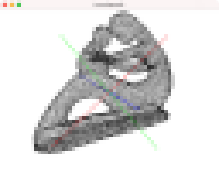
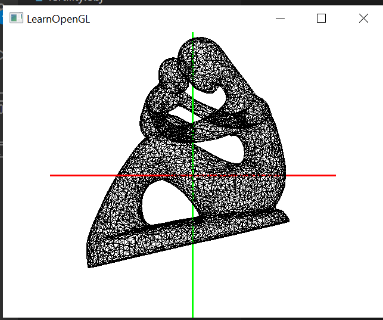
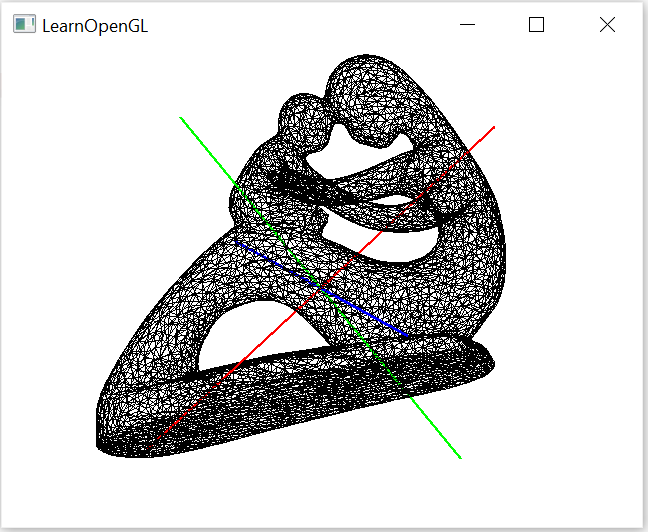
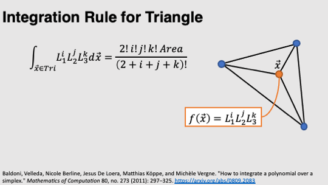
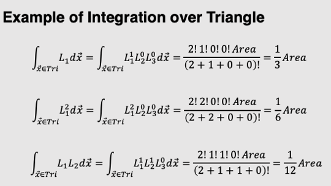
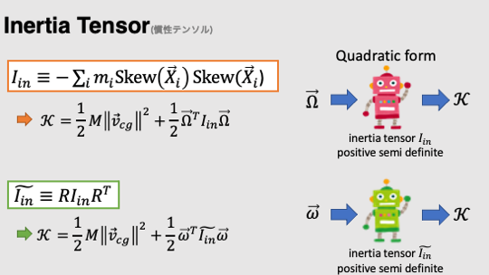
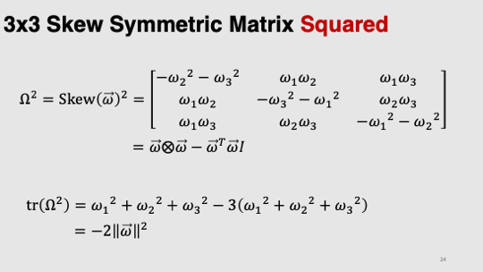

# Task11: Inertia Tensor

**Deadline: July 1st (Thursday) at 15:00pm**



## Setting Up

Please look at the following document for environment setup, creating branch, and making pull request.

- [How to Submit the Assignment](../doc/submit.md)

In this assignment, it is necessary to install [Eigen](https://eigen.tuxfamily.org/index.php?title=Main_Page) library. Please follow the following document for setting up.    

- [How to set up the Eigen Library](../doc/setup_eigen.md)  

Additionally, the library [DelFEM2](https://github.com/nobuyuki83/delfem2) must be in `pba-<username>/3rd_party`.  
Type following commands to install and update the library.

```bash
$ cd pba-<username> # go to the top of local repository
$ git submodule update --init 3rd_party/delfem2
```

(DelFEM2 is a collection of useful C++ codes written by the instructor.)


## 3D View control

- Alt + Left mouse drag = rotation
- Shift + Left mouse drag = translation 
- Mouse wheel = zoom in/out
  


## Problem1

Build the program using `cmake`. 
Run the program and take a screenshot image of the window. Paste the screenshot image below by editing this mark down document:

=== paste screenshot here ===


## Problem 2

Edit `main.cpp` to compute the 3x3 inertia tensor of a 3D mesh.
Note that **the mass is distributed only on the surface of the mesh** (i.e., the shape is hollow inside the mesh).
**The areal mass density of the surface is one**. 
The edit is probably only necessary around line #59 adding few lines of codes.

The inertia tensor should computed for the **rotation around the origin of the coordinate**. 
(the mesh is already translated such that the center of the mass is located at the origin).
The line in red, blue and green are the principal axes of the inertia tensor.

Write down the eigenvalues of the inertia tensor below (they will be shown in the standard output):
- 1st eigenvalue: 8.97496e+07
- 2nd eigenvalue: 1.81004e+08
- 3rd eigenvalue: 2.34771e+08


Paste the screenshot image below:

=== paste screenshot here ===


#### Comment:
The visualizations of inertia tensor principal axes is alligned with the eigen values and the visualiztion of eigen vectors.
* The first principle axis (red) has the lowest moment (Eigen value) and is the easiest to rotate around as the mass is more concenerated around the center (smaller effective radius).
* The second principle axis (green) has a higher moment with more mass distribution away from the axis (longer effective radius).
* The third principle axis (blue) has the highest moment with the most mass distribution (longest effective radius).


The following slides may be useful:










### Modified Code

```c++
// write some code below to compute inertia tensor
// Inertia Matrix is defines as Imat = -sum(mass*skew(x)^2)
// For a density of 1, mass is equivelant to volume (area)
// Imat = -sum(area*skew(x)^2)
// Since we have the center of the mass at the origin, and applying 
// parllel axis therom, We can sum over all trianglar meshes, and integrate over the triangle of each mesh
// We then write Imat = - sum(Imat_i)
// Imat_i = area_integral_over_triangle(skew(x)^2) 
// Given: skew(x)^2 = x.outer(x) - x.dot(x.T)*I
// and x can be written as tringular interpelation as:
// x = L1*P1 + L2*P2 + L3*P3
// skew(x)^2 = (L1*P1 + L2*P2 + L3*P3).outer(L1*P1 + L2*P2 + L3*P3) -
//             (L1*P1 + L2*P2 + L3*P3).dot(L1*P1 + L2*P2 + L3*P3)*I
// Using the distributive property
// skew(x)^2 = L1^2(P1.outer(P1) - P1.dot(P1)*I) +
//             L1L2(P1.outer(P2) - P1.dot(P2)*I) +
//             L1L3(P1.outer(P3) - P1.dot(P3)*I) +
//             L2L1(P2.outer(P1) - P2.dot(P1)*I) +
//             L2^2(P2.outer(P2) - P2.dot(P2)*I) +
//             L2L3(P2.outer(P3) - P2.dot(P3)*I) +
//             L3L1(P3.outer(P1) - P3.dot(P1)*I) +
//             L3L2(P3.outer(P2) - P3.dot(P2)*I) +
//             L3^2(P3.outer(P3) - P3.dot(P3)*I)
// Integrating the skew, the terms "Pi.outer(Pj) - Pi.dot(Pj)*I" is constant
// and comes out of the integral
// The integral over intgral of Li^2 = 1/6*area
// The integral over intgral of LiLj = 1/12*area
// We then iterate and sum over these terms for each set of points of a mesh.
for(unsigned int i=0;i<3;++i){
    for(unsigned int j=0;j<3;++j){
    if (i == j){
        // The integral over intgral of Li^2 = 1/6*area
        Imat -= (ap[i]*ap[j].transpose() - ap[i].dot(ap[j])*Eigen::Matrix3d::Identity())*area/6;
        } 
    else{
        // The integral over intgral of LiLj = 1/12*area
        Imat -= (ap[i]*ap[j].transpose() - ap[i].dot(ap[j])*Eigen::Matrix3d::Identity())*area/12;
        };
    };
};
```


