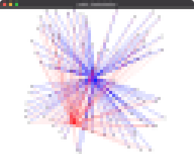
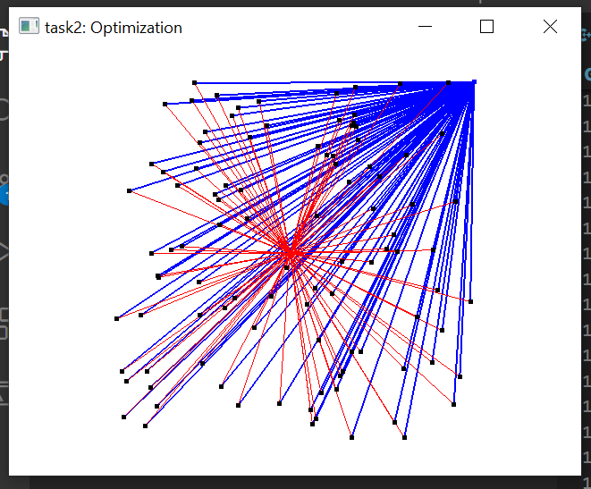
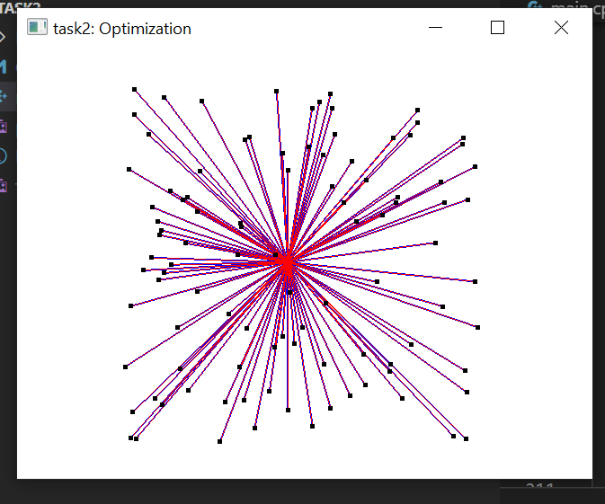

# Task2: Optimization

**Deadline: May 20th (Thursday) at 15:00pm**



## Setting Up

Pleae take a look at the following document for environment setup, creating branch, and making a pull request.

[How to Submit the Assignment](../doc/submit.md)

Additionally, you need the library [DelFEM2](https://github.com/nobuyuki83/delfem2) in `pba-<username>/3rd_party` 

```bash
$ cd pba-<username> # go to the top of local repository
$ git submodule update --init 3rd_party/delfem2
```

(DelFEM2 is a collection of useful C++ codes written by the instructer.)


## Problem1

Compile the code in this folder using `cmake`, use the **out-of-source build** too keep this directory clean. 
Run the program and take a screenshot image of the resulting window. 
Paste the screenshot below by editing this markdown document. 

=== paset screenshot here ===



## Problem 2

Optimize the position of the blue point using the Newton-Raphson method such that it will **minimise the sum of the squared distance between black points**.
The Newton-Raphson method requires gradient and hessian of the energy with respect to the position. 
Fill the code around line #90 to **analytically** compute the graiend and hessian of the squared distance. 
Paste the screenshot image of the result below. 

=== paset screenshot here ===



modified code:
```c++
// write some codes below to compute gradient and hessian of the energy defined in line #60.
    gradW[0] += 2*dx;       // dw/dx = d/dx(dx^2 + dy^2) = 2*dx
    gradW[1] += 2*dy;       // dw/dy = d/dy(dx^2 + dy^2) = 2*dy
    hessW[0][0] += 2;       // dw/dx2 = d/dx(2*dx) = 2
    hessW[0][1] += 0;       // dw/dxdy = d/dy(2*dx) = 0
    hessW[1][0] += 0;       // dw/dydx = d/dx(2*dy) = 0
    hessW[1][1] += 2;       // dw/dy2 = d/dy(2*dy) = 2
```