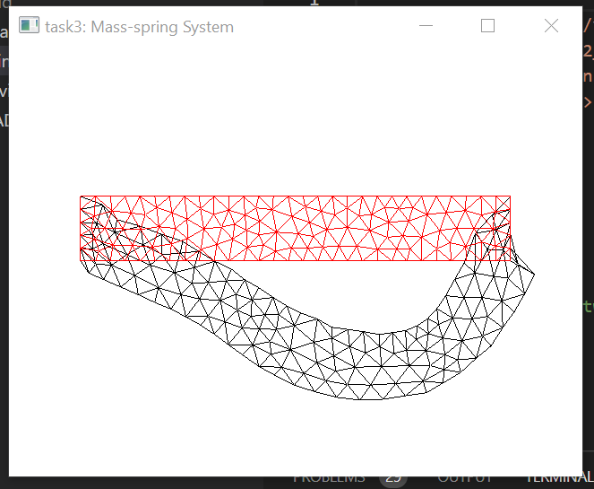

# Task3: Mass-spring System

**Deadline: May 27th (Thursday) at 15:00pm**


## Setting Up

Please take a look at the following document for environment setup, creating branch, and making pull request.

- [How to Submit the Assignment](../doc/submit.md)

In this assignment, it is necessary to install [Eigen](https://eigen.tuxfamily.org/index.php?title=Main_Page) library. 
Please follow the following document for setting up.    

- [How to set up the Eigen Library](../doc/setup_eigen.md)  


Additionally, you need the newest versio of the library [DelFEM2](https://github.com/nobuyuki83/delfem2) in `pba-<username>/3rd_party` . Please keep this library installed and updated by. 

```bash
$ cd pba-<username> # go to the top of local repository
$ git submodule update --init 3rd_party/delfem2
```

(DelFEM2 is a collection of useful C++ codes written by the instructer.)


## Problem1

Build the program using `cmake`. Run the program and take a screenshot image of the window. (You will probably see some *undesirable* animation and that's OK). Paste the screenshot image below by editing this mark down document:

=== paste screenshot here ===



## Problem 2

This program tries to solve the deformation of static mass-spring system by energy minimization using Netwon's method. However, unfortunately, the current implementation does not converge because the computation of the hessian of the spring's enegy is incomplete. 

- The springs energy can be written as `W=1/2(len-Len)*(len-Len) = 1/2C*C`, where `len` is current and `Len` is rest length and `C=(len-Len)`.
- Gradient can be written as `dW=C*dC` that is already implemented
- Hessian can be written as `ddW=dC*dC+C*ddC`. In the current code, `ddC`is not computed yes (set to zero) and thus the Newton's iteration does not converge. 

Fill the code around line #56 to compute the correct hessian of the energy (about 6-8 lines of simple codes). If the optimization works well, the energy should steadily decrease and converges within 10 iterations.

Paste the screenshot image of converged deformation below:

== paste screenshot image here==


modified code
``` c++

// C = ((ap[1][0] - ap[0][0])^2 + (ap[1][1] - ap[0][1])^2)^2 - Len
      // Given Len is constant >> dC = [[-(ap[1][0] - ap[0][0]) , - (ap[1][1] - ap[0][1])],
      //                                [(ap[1][0] - ap[0][0]) ,  (ap[1][1] - ap[0][1])]]/len
      // taking the derivative to ap[0][0] yeilds 
      // d/dp00(dC) = 1/len^2 *(len*[[1, 0],[-1, 0]] - dC*dC[0][0]/len)
      // since dC is already normalized above, the eqs change to:
      // d/dp00(dC) = ([[1, 0],[-1, 0]] - dC*dC[0][0])/len
      // d/dp01(dC) = ([[0, 1],[0, -1]] - dC*dC[0][1])/len
      // d/dp10(dC) = ([[-1, 0],[1, 0]] - dC*dC[1][0])/len
      // d/dp11(dC) = ([[0, -1],[0, 1]] - dC*dC[1][1])/len
      ddC[0][0][idim][jdim] =  ((1-2*idim)*(1-jdim) - dC[idim][jdim]*dC[0][0])/len;
      ddC[0][1][idim][jdim] =  ((1-2*idim)*(jdim)   - dC[idim][jdim]*dC[0][1])/len;
      ddC[1][0][idim][jdim] =  ((2*idim-1)*(1-jdim) - dC[idim][jdim]*dC[1][0])/len;
      ddC[1][1][idim][jdim] =  ((2*idim-1)*(jdim)   - dC[idim][jdim]*dC[1][1])/len;
```
There was also a bug when evaluating the ddw
``` c++
ddW[ino][jno][idim][jdim] =
              + stiffness * dC[ino][idim] * dC[jno][jdim]
              + stiffness * C * ddC[ino][jno][idim][jdim]; // ddW = k*dC*dC + k*C*ddC
``
should become
``` c++
ddW[ino][jno][idim][jdim] =
              + stiffness * dC[ino][idim] * dC[jno][jdim]
              + stiffness * C * ddC[ino][idim][jno][jdim]; // ddW = k*dC*dC + k*C*ddC  
        
```


