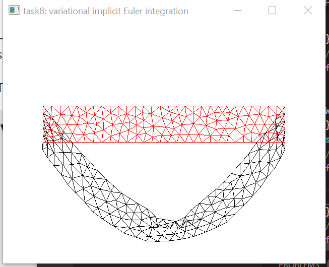
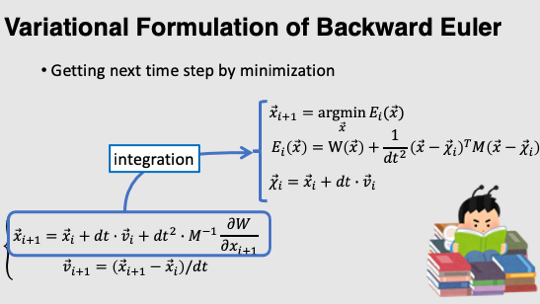
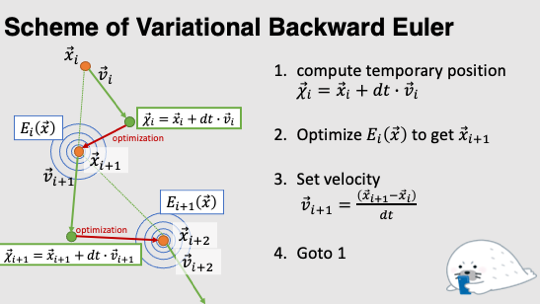
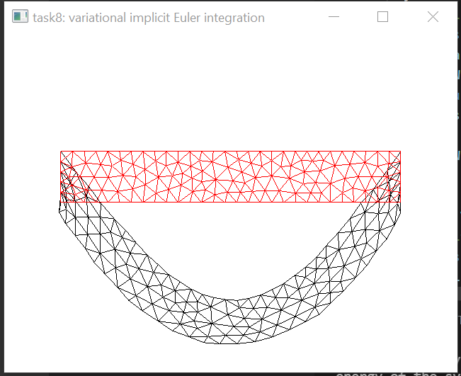

# Task8: Variational Time Integration 

**Deadline: June 24th (Thursday) at 15:00pm**


## Setting Up

Please take a look at the following document for environment setup, creating branch, and making pull request.

- [How to Submit the Assignment](../doc/submit.md)

In this assignment, it is necessary to install [Eigen](https://eigen.tuxfamily.org/index.php?title=Main_Page) library. Please follow the following document for setting up.    

- [How to set up the Eigen Library](../doc/setup_eigen.md)  


Additionally, you need the newest version of the library [DelFEM2](https://github.com/nobuyuki83/delfem2) in `pba-<username>/3rd_party` . Please keep this library installed and updated by. 

```bash
$ cd pba-<username> # go to the top of local repository
$ git submodule update --init 3rd_party/delfem2
```

(DelFEM2 is a collection of useful C++ codes written by the instructer.)


## Problem1

Build the program using `cmake`. Run the program and take a screenshot image of the window. Paste the screenshot image below by editing this mark down document:

=== paste screenshot here ===



## Problem 2

Currently the problem minimize the energy of a mass-spring system (see [task3)](../task3). Use the **variational implicit Euler scheme** [[16]](http://www.nobuyuki-umetani.com/scribble/variational_integration.pdf) to -change the static optimization into dynamic animation. Edit the function `AnimationByEnergyMinimization`  from line 104 to 169.

The following slide may be useful :






Paste the screenshot image of the animation below:

== paste screenshot image here==




### Modified Code


#### Added Inertia
```c++
// Set the position to the temporary position
// Optimize the energy starting from the temporary position not the original position

 aXY[i] += dt*aUV[i];
```

#### Added Inertia
```c++
// The energy of system E(x) = W(x) + ((x-Xi)^T M (x-Xi))/dt^2
// Given M is symmetric matrix
// dE = dW + 2/dt^2*((x-Xi)^T M)
// if we estimate gradient at Xi dE = dW
// gradW(i) += 0;
// ddE = ddW + 2*M/dt^2
hessW(i,i) += 2*mass_point/(dt*dt);
```

#### Position and Velocity Update
```c++
// E is minimized by updating x using netwon's method
// x(t+1) = x(t) - dE/ddE 
// define:   update = dE/ddE
// x(t+1) = x(t) - update
// Set the velocity v = (x(t+1) - x(t))/dt 
// v = (x(t) - update - x(t))/dt = -update/dt
aUV[i] = -update(i)/dt;
aXY[i] = aXY[i]-update(i);
// Reiterate with updated position and velocity
```


